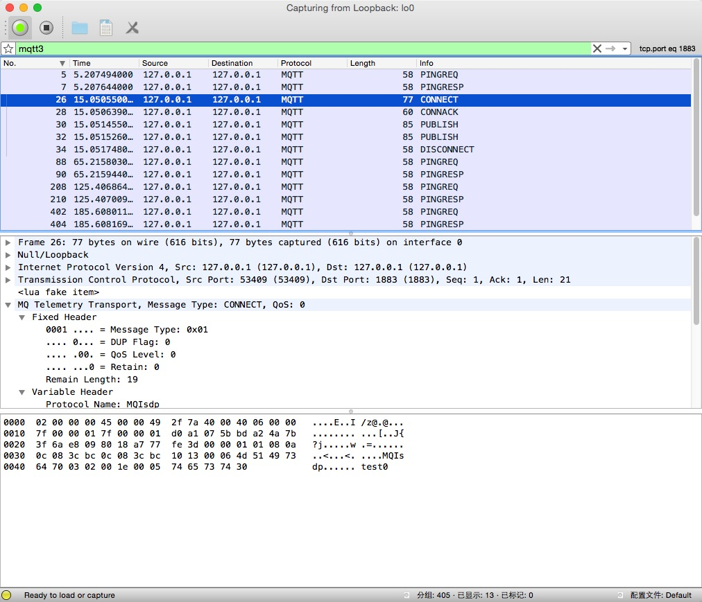

Wireshark-MQTT
===========================

MQTT dissector for Wireshark was developed for debugging
libemqtt (https://github.com/menudoproblema/libemqtt)

This fork add wireshark 1.12+ & lua 5.2 support on OS x(10.10).

Usage
=====
* install wireshark and lua on os x with homebrew:
```
  brew install wireshark lua --with-qt5
```
* copy mqtt.lua to ~/.wireshark/plugins/mqtt.lua
* using wireshark to capturing packets and filter MQTT by using keyword mqtt3


Others Information 
=======
Same as originally library(https://github.com/menudoproblema/Wireshark-MQTT)
